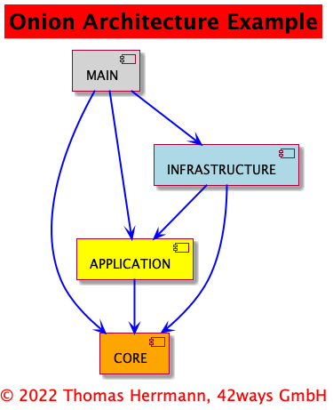

# Java Architecture Playground

This repo is just for some experiments in Java Software Architecture Patterns, esp. to get a feeling
for advantages and disadvantages of an Onion Architecture / Clean Architecture.

Therefore, this project has as few as possible dependencies.

To show the code dependencies, the project is split up into several modules with restricted access between them.

The dependencies between the modules are shown in this graphics:



## Usage
The module `main` includes some demo programs that can be started by running
the main methods from within IntelliJ or directly on the command line.

After compilation you can use e.g.
```java -cp out/production/core:out/production/application:out/production/infrastructure:out/production/main:lib/* de.fourtytwoways.onion.PersonDemo```
or
```java -cp out/production/core:out/production/application:out/production/infrastructure:out/production/main:lib/* de.fourtytwoways.onion.EnumDemo```
to run the demo/test programs.
