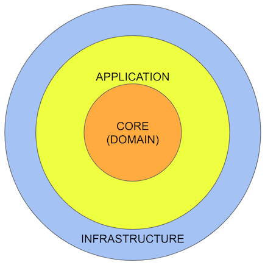

[](https://github.com/42ways/onion-architecture-blueprint/actions/workflows/gradle.yml)

# Onion Architecture Blueprint

This project is a blueprint for the so-called "Onion Architecture", which is a very popular
architectural pattern for domain driven design (DDD).

The basic ideas were published as a
[series of Blog Posts](https://jeffreypalermo.com/2008/07/the-onion-architecture-part-1/) by
[Jeffrey Palermo](https://jeffreypalermo.com/).

This blueprint implementation for an onion architecture started as a playground with some experiments in
Java Software Architecture Patterns in general, esp. to get a feeling for advantages and disadvantages
of major Onion Architecture and Clean Architecture principles.

To show the relevant patterns, the project has as few as possible dependencies.
The implemented functions and use cases are kept very simple for the same reason.

To make the code dependencies explicit, the project is split up into several
Java modules with restricted access between the modules.
Real live projects would probably separate these modules into different repositories and/or
introduce an even further separation into packages, modules and source code repositories.

The following diagrams visualize the actual component dependencies of this project based on the implemented
java modules in comparison to the "pure" onion diagram that can be found in most articles and books
about this architectural pattern.




## Build

### Gradle build

The project comes with gradle build files, including the project module structure and dependencies as well as
the external dependencies. See `gradle.settings` in the root directory and `gradle.build` in the modules.

You can use Gradle via the included `gradlew` (Posix) or `gradlew.bat` (Windows) script without installing Gradle first, e.g.

```gradlew build```

See the [official Gradle documentation](https://docs.gradle.org/current/userguide/userguide.html) for further info.

### IntelliJ IDE

The project was written using IntelliJ IDEA, but the build, esp. the dependencies, is based on `gradle`
(and Java Modules).
Therefore the `.idea/` folder is excluded from `git`.

You can open the project as Gradle project with IntelliJ (and probably any other IDE such as Eclipse), and
all settings should be correct. Please beware to use the gradle tasks and environment for the run configurations
as well.

## Dependencies and 3rd party tools

All dependencies are specified in the gradle configuration and build files.
Please refer to this actual source of truth regarding the current dependencies,
since this README might be out of date.

### Annotations and libraries

The project uses JPA for persistence (only in the infrastructure layer),
in the implementation variant [Hibernate](https://hibernate.org/).

In order to get rid of some shortages of the Java language (especially the noisiness),
we also added [Lombok](https://projectlombok.org/) and [Google Guava](https://github.com/google/guava) to the mix.

### QA and documentation tools

The project uses several tools for QA and documentation, so there are dependencies to

* [JUnit Jupiter](https://junit.org/junit5/), the standard testing framework for Java
* [SpotBugs](https://spotbugs.github.io/), the successor of FindBugs
* [ArchiDoc](https://github.com/wilmerkrisp/archidoc), the Gradle wrapper for [Classgraph](https://github.com/classgraph/classgraph) 

## Usage

The module `demo` includes some demo programs that are available as Gradle tasks `runEnumDemo`,
`runPersonDemo` and `runContractDemo`.

The demo programs use a H2 database configured to use file based storage in `demo/.h2` (see configuration file
`infrastructure/src/main/resources/hibernate.cfg.xml`).

## Caveats

This project is just a playground for different aspects of Domain Driven Design (DDD),
Onion Architecture and Software-Architecture / Software-Design in general.

Many of the concepts, patterns and coding found in this implementation are more or less just
attempts to evaluate ideas and/or compare different approaches for several aspects.

Therefore, the project as a whole may seem inconsistent, premature or even plain wrong.
