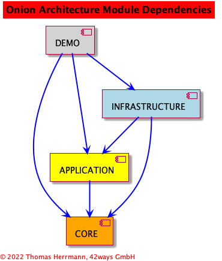

# Onion Architecture Blueprint

This project is a blueprint for the so called "Onion Architecture", which is a very popular
architectural pattern for domain driven design (DDD).

The basic ideas were published as a
[series of Blog Posts](https://jeffreypalermo.com/2008/07/the-onion-architecture-part-1/) by
[Jeffrey Palermo](https://jeffreypalermo.com/).

This blueprint implementation for an onion architecture started as a playground with some experiments in
Java Software Architecture Patterns in general, esp. to get a feeling for advantages and disadvantages
of major Onion Architecture and Clean Architecture principles.

To show the relevant patterns, the project has as few as possible dependencies.
The implemented functions and use cases are kept very simple for the sane reason.

To make the code dependencies explicit, the project is split up into Java modules
with restricted access between the modules.
Real live projects would probably split these modules into different repositories.

The dependencies between the modules are:



## Dependencies and setup

### Gradle build

The project comes with gradle build files, including the project module structure and dependencies as well as
the external dependencies. See `gradle.settings` in the root directory and `gradle.build` in the modules.

You can use Gradle via the included `gradlew` (Posix) or `gradlew.bat` (Windows) script without installing Gradle first, e.g.

```gradlew build```

See the [official Gradle documentation](https://docs.gradle.org/current/userguide/userguide.html) for further info.

### IntelliJ IDE

The project was written using IntelliJ IDEA.
The project configuration is stored in `.idea`, configured via the gradle files.

## Usage

The module `demo` includes some demo programs that are available as Gradle tasks `runEnumDemo`,
`runPersonDemo` and `runContractDemo`.

The demo programs use a H2 database configured to use file based storage in `demo/.h2` (see configuration file
`infrastructure/src/main/resources/hibernate.cfg.xml`).

